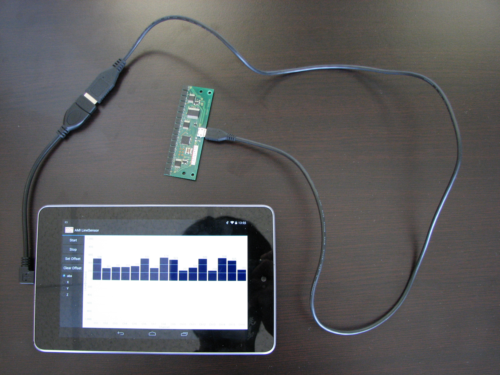
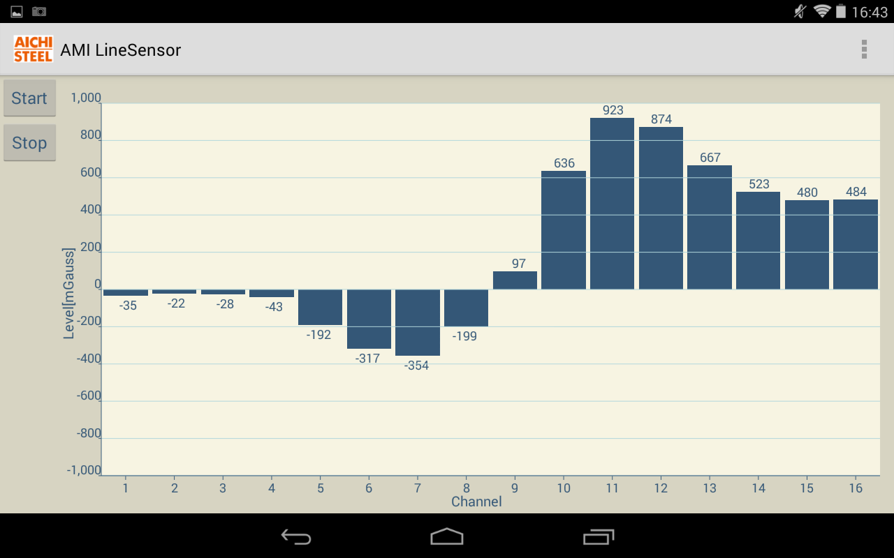

AMI Line Sensor Android Application
==================
This is the source code for an android demo application of [Line Sensor(AMI305-AR16)](http://www.aichi-mi.com/measuring/line_en.html), which has 16 pcs. AMI-305 3-axis magnetometers in a single board. It is required to use the sensor and a USB-OTG adapter to run the application. In order to purchase the sensor or any questions, please contact to [Aichi Micro Intelligent Corporation](http://www.aichi-mi.com/).

AMI Line Sensor connected to Nexus7 through OTG adapter.

LineSensor.apk captured image.

External Libraries(included in the project)
---------------------------------
- achartengine-1.2.0.jar  (https://code.google.com/p/achartengine/)
- physicaloidlibrary.jar  (https://github.com/ksksue/PhysicaloidLibrary)
- d2xx.jar  (http://www.ftdichip.com/Android.htm)

System Requirements For LineSensor.apk
---------------------------------
- Android Tablet with OTG capability
- Android 4.0 or higher
- USB-OTG adapter/cable

Contact Information
---------------------------------
[Aichi Micro Intelligent Corporation](http://www.aichi-mi.com/)

License
---------------------------------
This project is released under the [Apache License, Version 2.0](http://www.apache.org/licenses/LICENSE-2.0).
